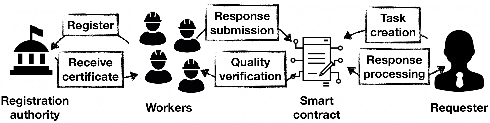

# AVeCQ: Anonymous Verifiable Crowdsourcing with Worker Qualities

Authors: Vlasis Koutsos, Sankarshan Damle, Dimitrios Papadopoulos, Dimitris Chatzopoulos, Sujit Gujar
Appears in: IEEE Transactions on Dependable and Secure Computing (TDSC) 

## TL;DR

In crowdsourcing systems, requesters publish tasks, and interested workers provide answers to get rewards. Worker anonymity motivates participation since it protects their privacy. Anonymity with unlinkability is an enhanced version of anonymity because it makes it impossible to ``link'' workers across the tasks they participate in. Another core feature of crowdsourcing systems is worker quality which expresses a worker's trustworthiness and quantifies their historical performance. Notably, worker quality depends on the participation history, revealing information about it, while unlinkability aims to disassociate the workers' identities from their past activity. In this work, we present AVeCQ, the first crowdsourcing system that reconciles these properties, achieving enhanced anonymity and verifiable worker quality updates. AVeCQ relies on a suite of cryptographic tools, such as zero-knowledge proofs, to (i) guarantee workers' privacy, (ii) prove the correctness of worker quality scores and task answers, and (iii) commensurate payments. AVeCQ is developed modularly, where the requesters and workers communicate over a platform that supports pseudonymity, information logging, and payments.

 

## Implementation

In order to compare AVeCQ with the state-of-the-art, we prototype it over Ethereum, deployed on the Goerli and Rinkeby TestNets. AVeCQ outperforms the state-of-the-art in three popular crowdsourcing tasks (image annotation, average review, and Gallup polls). For instance, for an Average Review task with 5 choices and 128 participating workers AVeCQ is 40\% faster (including overhead to compute and verify the necessary proofs and blockchain transaction processing time) with the task's requester consuming 87\% fewer gas units.

### Requirements
- Zokrates: For implementing zk-SNARKs
- Web3J
- pycrypto: Zokrates companion crypto library

## Citation
```
@ARTICLE{KDPCG24,
  author={Koutsos, Vlasis and Damle, Sankarshan and Papadopoulos, Dimitrios and Chatzopoulos, Dimitris and Gujar, Sujit},
  journal={IEEE Transactions on Dependable and Secure Computing}, 
  title={AVeCQ: Anonymous Verifiable Crowdsourcing with Worker Qualities}, 
  year={2024},
  volume={},
  number={},
  pages={1-18},
  keywords={Anonymity;zk-SNARKs;Crowdsourcing;Blockchain},
  doi={10.1109/TDSC.2024.3396342}}
```
